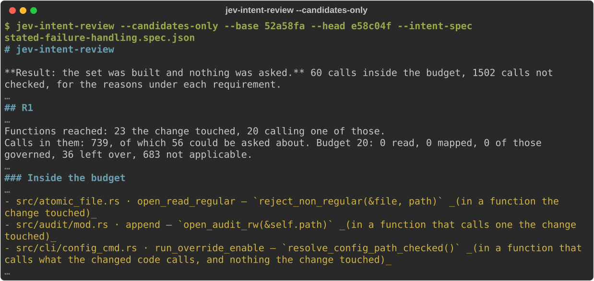

# jev-intent-review

**Intent-aware review beyond the diff.**

`jev-intent-review` checks whether a pull request actually satisfies the intent behind it — including code the diff did not touch.
It starts from the requirement, not from the changed lines: **the diff is a search hint, not the review boundary.**

It reads **Rust** only, and requirements written in **two shapes** — a requirements section or a `Property:` paragraph — asking one of **two things** of each call: how a failure must reach the caller, or that a check passes before an action.

## Demo

A real run on omamori's [PR #476](https://github.com/yottayoshida/omamori/pull/476) (`52a58fa` → `e58c04f`) with the requirements in [`bench/fixtures/omamori-468/stated-failure-handling.spec.json`](bench/fixtures/omamori-468/stated-failure-handling.spec.json).
`--candidates-only` builds the set of calls and sends nothing to Jev. Lines left out are marked `…`.



The image is drawn from that run's output by [`docs/demo/render.py`](docs/demo/render.py), which refuses to draw a line the output does not contain.

Without `--candidates-only`, each of those calls is asked about and the report sorts them into *worth checking*, *holding*, *not settled* and *not required of by the requirement* — see [reading the output](docs/local-check-cli.md#reading-the-output).

## Quick start

Node.js 22.18+ is required. `npm install -g jev-intent-review` installs the last release; what this README describes is on `main`, so build it from source:

```sh
npm install
npm run build
npm pack
npm install -g ./jev-intent-review-*.tgz
```

Choose a Jev host and set its key ([Jev endpoint](docs/usage.md#jev-endpoint)), then run against two revisions:

```sh
export JEV_PROVIDER=typesafe
export TYPESAFE_API_KEY=...
jev-intent-review --base <base> --head <head> --intent-spec spec.json
```

On pull requests, use the Action: one workflow file, two secrets and one requirement, in
[docs/quickstart.md](docs/quickstart.md). Pin it to a commit: there is no tag yet.
The check run puts the calls worth checking and the ones not settled first; every call, with its
reason, is in the artifact. Pull requests from forks are not reviewed. Why, and what a run leaves:
[docs/github-action.md](docs/github-action.md).

## What it does

* **Reads requirements as written.** From a requirements section (`## Acceptance criteria`, `## Done when`, …) or a `Property:` paragraph in the issue or pull request. No model writes them or picks them out of prose ([writing requirements](docs/writing-requirements.md)).
* **Looks past the diff.** The functions the change touched, their callers one hop out, and the other callers of what the changed code calls — the path a fix may have missed.
* **Asks small typed questions, not for a review.** Each call is put to [Jev](https://docs.typesafe.ai/introduction) as fixed questions with probabilities, and the evidence and answers are printed so a person can check or reject them. A call worth checking is a candidate, not a verdict: the exit code stays 0 unless `policy.fail_on: [finding]` is set.

## Status

Experimental. Calls are read in Rust repositories only (in any other language only the change question runs), and Jev is the only model it sends anything to.
It does not claim repository-wide verification, and no finding does not prove a requirement holds.
Surfacing a defect in an unchanged caller is the goal; how far it gets today is in [what has been measured](docs/local-check-cli.md#what-has-been-measured).

## Docs

* [Quick start on a Rust repository](docs/quickstart.md) — the workflow, the secrets, one requirement, reading the check run
* [Why, and what it is aiming at](docs/overview.md) — the problem, an example, the pipeline, the current scope
* [Using the command](docs/usage.md) — flags, `--json`, the JevFuzz trace, how intent is read, Jev hosts, development
* [GitHub Action](docs/github-action.md) — inputs, what a run leaves, reused answers, limits, which pull requests are reviewed
* [Writing requirements](docs/writing-requirements.md) — the two forms, issue and pull request templates
* [The local check](docs/local-check-cli.md) — exact behavior, the output, exit codes, every measurement
* [Design](docs/SPEC.md) and [decisions](docs/adr/)

## License

MIT OR Apache-2.0
